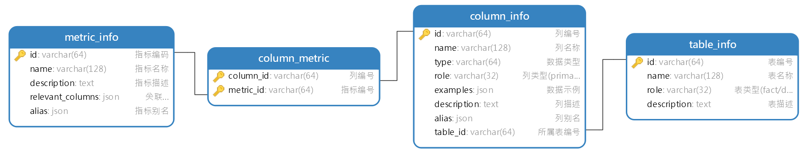
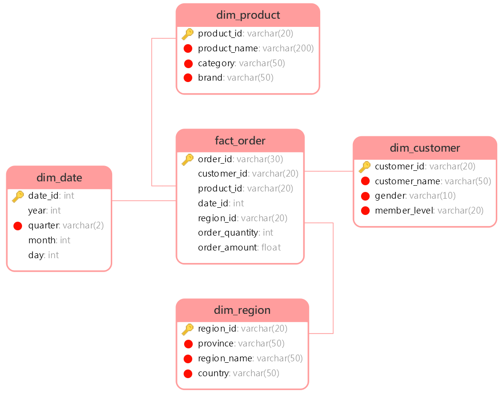

# 面向数据仓库的 Text-to-SQL Agent 

# 1. 项目概述

面向数据仓库的 Text-to-SQL Agent 是一个基于自然语言处理与数据分析技术的智能数据服务系统，面向数据仓库应用场景，旨在帮助用户通过对话方式高效获取数据仓库中的数据洞察。用户无需掌握复杂的查询语法，即可用自然语言提出问题，系统自动完成对数据仓库数据的理解、计算分析与结果可视化，大幅提升数据使用效率，降低数据分析门槛，助力业务决策智能化。


# 2. 项目架构

本项目以数据仓库的元数据为核心，使用 MySQL 存储结构化元数据信息，结合 Qdrant 构建语义向量索引、Elasticsearch 构建全文索引，形成统一的元数据知识库。查询过程中，系统首先根据用户自然语言问题进行多路召回，筛选相关表、字段及指标定义，再将元数据信息与用户问题共同输入大模型生成 SQL，最终完成自动查询与结果返回，确保生成结果的准确性与可控性。

## 2.1 元数据知识库

元数据知识库作为数据仓库的语义基础设施，用于集中管理和高效检索表结构、字段定义、字段取值示例及复杂指标说明等元数据信息，支撑后续的智能检索与 SQL 生成。

元数据信息主要来源于两部分：一部分数据仓库自动采集，另一部分由人工进行补充与配置。完整的元数据统一存储于 MySQL 数据库中，并对其中部分关键信息构建向量索引和全文索引，以提升语义召回与关键词召回的效果。

### 2.2.1 元数据库

元数据库共包含四张表，具体结构如下图所示：



### 2.2.2 向量索引

本项目选用 [Qdrant](https://qdrant.tech/) 作为向量数据库，向量索引主要用于对**指标信息**和**字段信息**进行语义召回。向量索引的构建内容具体如下：

- metric_info


- column_info

  

### 2.2.4 全文索引

本项目使用 Elasticsearch 作为全文检索引擎，全文索引主要用于对**字段取值**进行检索与匹配，索引内容以各类维度值为主，具体如下：



## 2.2 Text-to-SQL智能体

本项目的智能体主体基于Langgraph构建，具体结构如下图所示：


# 3. 项目开发环境

## 3.1 项目目录结构

```tex
data-agent 根目录
├── app 代码目录
│   ├── agent 智能体
│   ├── api 接口
│   ├── clients 数据库客户端
│   ├── config 配置类
│   ├── core 基础设施
│   ├── models 数据库实体类
│   ├── prompt 提示词工具
│   ├── repositories Repo层——负责数据库底层查询
│   ├── schemas 接口数据实体
│   ├── scripts 脚本
│   └── service Service层——负责具体的业务逻辑
├── conf 配置文件
├── docker 开发环境
│   ├── elasticsearch
│   ├── embedding
│   └── mysql
├── logs 日志目录
└── prompts 提示词目录
```

## 3.2 创建项目

本项目使用 `uv`进行依赖管理与虚拟环境管理

## 3.3 安装项目所需依赖

以下是项目所需的全部依赖

```bash
uv add asyncmy cryptography "elasticsearch[async]>=8,<9" fastapi[standard] huggingface-hub jieba langchain langchain-deepseek langchain-huggingface langgraph loguru omegaconf pyyaml qdrant-client sqlalchemy
```

## 3.4 搭建开发环境

本项目采用 Docker 管理开发环境。将该目录拷贝至项目根目录后，进入 `docker` 目录并执行 `docker compose up -d`，即可一键启动项目所需的全部基础服务。


# 4. 项目基础设施

## 4.1 配置参数管理

### 4.1.1 配置文件

本项目采用 YAML 文件管理配置参数，配置文件的路径为 `data-agent/conf/app_config.yaml` 。以下是本项目所需的全部参数。

```yaml
logging:
  file:
    enable: true
    level: INFO
    path: logs
    rotation: "10 MB"
    retention: "7 days"
  console:
    enable: true
    level: INFO

db_meta:
  host: localhost
  port: 3306
  user: root
  password: root
  database: meta

db_dw:
  host: localhost
  port: 3306
  user: root
  password: root
  database: dw

qdrant:
  host: localhost
  port: 6333
  embedding_size: 1024

embedding:
  host: localhost
  port: 8081
  model: BAAI/bge-large-zh-v1.5


es:
  host: localhost
  port: 9200
  index_name: data_agent


llm:
  model_name: deepseek-chat
  api_key: <deepseek_api_key>

```

### 4.1.2 加载工具

本项目使用的yaml配置文件加载工具为[OmegaConf](https://omegaconf.readthedocs.io/en/2.3_branch/index.html)，具体用法参考其官网即可。

用于读取配置文件的代码放置在`data-agent/app/conf/app_config.py`文件中，具体内容如下：

```python
from dataclasses import dataclass
from pathlib import Path

from omegaconf import OmegaConf


# 日志配置
@dataclass
class File:
    enable: bool
    level: str
    path: str
    rotation: str
    retention: str


@dataclass
class Console:
    enable: bool
    level: str


@dataclass
class LoggingConfig:
    file: File
    console: Console


# 数据库配置
@dataclass
class DBConfig:
    host: str
    port: int
    user: str
    password: str
    database: str


@dataclass
class QdrantConfig:
    host: str
    port: int
    embedding_size: int


@dataclass
class EmbeddingConfig:
    host: str
    port: int
    model: str


@dataclass
class ESConfig:
    host: str
    port: int
    index_name: str


@dataclass
class LLMConfig:
    model_name: str
    api_key: str


@dataclass
class AppConfig:
    logging: LoggingConfig
    db_meta: DBConfig
    db_dw: DBConfig
    qdrant: QdrantConfig
    embedding: EmbeddingConfig
    es: ESConfig
    llm: LLMConfig


config_file = Path(__file__).parents[2] / 'conf' / 'app_config.yaml'
context = OmegaConf.load(config_file)
schema = OmegaConf.structured(AppConfig)
app_config: AppConfig = OmegaConf.to_object(OmegaConf.merge(schema, context))
```

# 5. 构建元数据知识库

具体实现参考代码即可。

# 6. 构建问数智能体

具体实现参考代码即可。

# 7. 前后端联调

具体实现参考代码即可。


